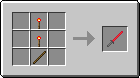
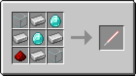
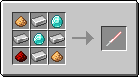
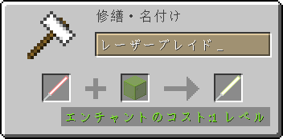
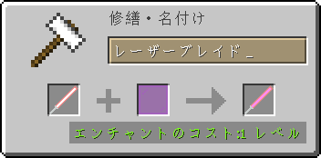
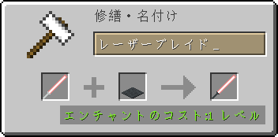

# ToLaserBlade v1.16.1-3.1.5.0

## 動作環境

- Minecraft 1.16.1
- Minecraft Forge 1.16.1-32.0.98+

### 推奨mod

- Just Enough Items (JEI)　クラフトやアップグレードのレシピをゲーム内で見ることができる

## ダウンロード

- [ダウンロードサイト（Curse Forge）](https://www.curseforge.com/minecraft/mc-mods/tolaserblade/files)

### JARファイルについて

- 当modのjarファイルの著作権はmodの著作者に帰属します
- ただし、内容を変更しない状態での再配布やmodパックへの収録は可能です
- Modの利用や配布にあたってはMojang Studiosの定めるMinecraftエンドユーザーライセンス条項（EULA）及びガイドラインに従ってください

## アイテム解説

### DXレーザーブレ一ド / DX Laser B1ade

素材：レッドストーントーチ×2、棒×1  

>レーザーブレイドを模して木の棒にレッドストーンを塗った剣。元々は刃が光ったり音が鳴ったりと様々なギミックが仕込まれていたというが、電源となるパーツが失われてしまったため今はもう動かない。バニラの剣よりも少しだけ攻撃力の回復が早く、石の剣並みの攻撃力と鉄の剣並みの耐久力がある。

- タイプ：剣
- 攻撃速度：2.8
- 攻撃力：5
- 耐久値：255
- エンチャントテーブルで剣タイプのエンチャントが可能

右クリックでレッドストーントーチに関連した隠し機能が使用できる。

- 耐久値が半分以上残っているとき、地面や壁をスニーク状態で右クリックすると耐久値を消費してレッドストーントーチを設置する
- 耐久値が半分未満のとき、設置されたレッドストーントーチを右クリックするとそれを消費して耐久値を回復する
- 耐久値が半分以上のとき、設置されたレッドストーントーチを右クリックするとそれを回収する

### レーザーブレイド / Laser Blade

- タイプ：剣
- 基本攻撃速度：2.8
- 基本攻撃力：7
- 耐久値：32000
- クラフト時に【光属性（Light Element）】と【効率強化（Efficiency）】のエンチャントが付与される
  - 【光属性】は当modで追加される独自のエンチャントであり、アンデッドと邪悪な村人へのダメージが増加する
  - 【効率強化】はレベルが高いほどレーザーブレイドの採掘速度が上昇する。一方で【効率強化】がエンチャントされていない状態では採掘能力を失う
- クラフト時にプレイヤーがいたバイオームの種類によっては、刃の色が赤以外になることもある
- 右マウスボタンで盾のようにガード（ブロッキング）することができる（要コンフィグファイル編集）

#### 【光属性I】＆【効率強化I】レシピ

素材：ガラス×2、鉄インゴット×4、ダイヤモンド×2、レッドストーンダスト×1  

>古代文明の超技術で作られたかもしれないレーザーの刃を持つ《絶対に刃こぼれしない》剣。レッドストーンで励起させたイオン添加ガラスの発する光で励起させたダイヤモンドから発生した光を反射によって増幅し、ダイヤモンドのレンズで収束させてからレッドストーンの力場に閉じ込めることで棒状の光の刃にしているという。たぶん光属性なのでアンデッドや邪悪な村人に対して強い。なお本来の用途は切削用の工具であった。

- エンチャント：光属性I、効率強化I

#### 【光属性II】＆【効率強化I】レシピ

素材：グロウストーンダスト×2、鉄インゴット×4、ダイヤモンド×2、レッドストーンダスト×1  

>一次レーザー媒質をイオン添加ガラスからグロウストーンに変更して出力を強化したレーザーブレイド。そのおかげか光属性がさらに強まったようだ。古代文明が栄えまだグロウストーンが地上でよく採れた時代にはこの発振方式が主流であったと怪しい古文書は伝える。

- エンチャント：光属性II、効率強化I

#### レーザーブレイドの染色

レーザーブレイドは金床で特定のアイテムと合成することにより色を変更することができる。

- 「色付きガラス」と合成すると「刃の外側部分」の色を変更することができる  
  
- 「色付きガラス板」と合成すると「刃の内側部分」の色を変更することができる  
  
- 「カーペット」と合成すると「柄の部分」の色を変更することができる  
  

#### レーザーブレイドのアップグレード

- 金床で特定のアイテムと一定のレベルを消費することによりレーザーブレイドを強化することができる

≪書きかけ≫

#### レーザーブレイドの修理

- 耐久値の減ったレーザーブレイドは金床で鉄インゴットと合成すると耐久値を回復させることができる  
  

>《絶対に刃こぼれしない》を謳うレーザーブレイドが消耗することについて消費者保護団体がメーカーに問い詰めたところ、メーカー側は苦し紛れにも「消耗しているのはグリップ部分であり刃自体は消耗していない」と弁明した。結局、メーカーがグリップの無償交換に応じることでこの事態は収まったという。

### 壊れたレーザーブレイド / Broken Laser Blade

≪書きかけ≫

### レーザーブレイド / Laser Blade（耐火）

≪書きかけ≫

### 壊れたレーザーブレイド / Broken Laser Blade（耐火）

≪書きかけ≫

## 設定項目（コンフィグ）

≪書きかけ≫

---
&copy; 2016-2020 Iunius118
