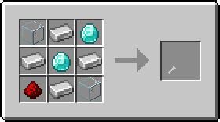
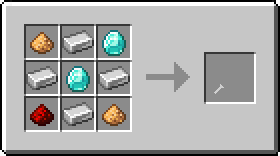
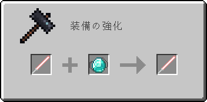
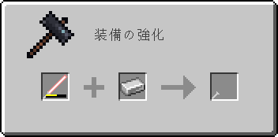
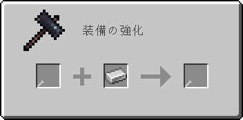
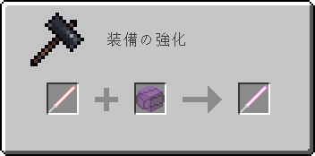
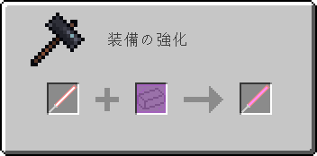
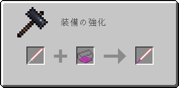
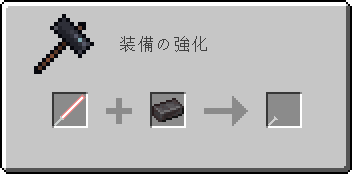
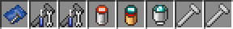

# ToLaserBlade v1.16.4-4.1.4.0

ToLaserBladeはMinecraftに光の刃を持つ剣「レーザーブレイド」を追加するmodです。

## 動作環境

- Minecraft 1.16.4
  - Minecraft Forge 1.16.4-35.1.4+
- Minecraft 1.16.5
  - Minecraft Forge 1.16.5-36.0.0+

### 推奨mod

- Just Enough Items (JEI)  
  ゲーム内でクラフトやアップグレードのレシピを見ることができます

## ダウンロード

- [ダウンロードサイト（Curse Forge）](https://www.curseforge.com/minecraft/mc-mods/tolaserblade/files/all)

### .JARファイルについて

- 当modの.jarファイルの著作権はmodの著作者に帰属します
- ただし、内容を変更していない完全な状態での再配布やmodパックへの収録は可能です
- Modの利用や配布にあたってはMojang Studiosの定めるMinecraftエンドユーザーライセンス条項（EULA）及びガイドラインに従ってください

## チュートリアル

### レーザーブレイドの入手

1. 「新品のレーザーブレイドⅠ」または「新品のレーザーブレイドⅡ」をクラフトします
2. それを手に持って右クリックしてください

 

### レーザーブレイドのアップグレード

1. 鍛冶台をクラフトして設置します
2. 鍛冶台でレーザーブレイドと特定のアイテムを組み合わせてください

### レーザーブレイドの修理

1. 鍛冶台で消耗したレーザーブレイドや「壊れたレーザーブレイド」を鉄インゴットと組み合わせてください
2. 元のレーザーブレイドの能力が保存された「新品のレーザーブレイド」が入手できます
3. それを手に持って右クリックしてください

 

## アイテム解説

### DXレーザーブレ一ド / DX Laser B1ade

  
Item ID: `tolaserblade:dx_laser_blade`

- タイプ：剣
- 攻撃速度：2.8
- 攻撃力：5
- 耐久値：255
- エンチャントテーブルで剣タイプのエンチャントが可能です

>レーザーブレイドを模して木の棒にレッドストーンを塗った剣。元々は刃が光ったり音が鳴ったりと様々なギミックが仕込まれていたというが、電源となるパーツが失われてしまったため今はもう動かない。バニラの剣よりも少しだけ攻撃力速度が速く、石の剣並みの攻撃力と鉄の剣並みの耐久力がある。

#### レシピ

素材：レッドストーントーチ×2、棒×1  

#### 隠し機能

右クリックでレッドストーントーチに関連した隠し機能が使用できます。

- 耐久値が半分以上残っているとき、地面や壁をスニーク状態で右クリックすると耐久値を消費してレッドストーントーチを設置します
- 耐久値が半分未満のとき、設置されたレッドストーントーチを右クリックするとそれを消費して耐久値を回復します
- 耐久値が半分以上のとき、設置されたレッドストーントーチを右クリックするとそれを回収します

### 新品のレーザーブレイド / Brand-new Laser Blade

- クラフトやレーザーブレイドのアップグレード・修理で入手することができるアイテムです
- 手に持って右クリックするとレーザーブレイドを入手することができます

#### 新品のレーザーブレイドⅠ / Brand-new Laser Blade I

Item ID: `tolaserblade:lb_brand_new_1`

素材：ガラス×2、鉄インゴット×4、ダイヤモンド×2、レッドストーンダスト×1  

- 入手できるレーザーブレイドの性能
  - 攻撃速度：2.8
  - 基本攻撃力：7
  - エンチャント：光属性I、効率強化I
  - 色：レーザーブレイドを入手したバイオームによっては刃の色が変わることもあります
  - モデル：レーザーブレイドを入手した日付（サーバー側時計基準）によっては通常と異なるモデルで描画されることがあります（`renderMultipleModels`有効時）

#### 新品のレーザーブレイドⅡ / Brand-new Laser Blade II

Item ID: `tolaserblade:lb_brand_new_2`

素材：ガラス×2、鉄インゴット×4、ダイヤモンド×2、レッドストーンダスト×1  

- 入手できるレーザーブレイドの性能
  - 攻撃速度：2.8
  - 基本攻撃力：7
  - エンチャント：光属性II、効率強化I
  - 色：レーザーブレイドを入手したバイオームによっては刃の色が変わることもあります
  - モデル：レーザーブレイドを入手した日付（サーバー側時計基準）によっては通常と異なるモデルで描画されることがあります（`renderMultipleModels`有効時）

#### 新品のレーザーブレイド / Brand-new Laser Blade （通常）

Item ID: `tolaserblade:lb_brand_new`

レーザーブレイドを修理すると入手できます。

元のレーザーブレイドの能力値、エンチャント、色などが保存されており、手に持って右クリックするとレーザーブレイドを入手することができます。

- 入手できるレーザーブレイドの性能
  - このアイテムに保存されている能力値、エンチャント、色などがそのままコピーされます

#### 新品のレーザーブレイド / Brand-new Laser Blade （耐火）

Item ID: `tolaserblade:lb_brand_new_fp`

レーザーブレイドをアップグレードで耐火化したりレーザーブレイド（耐火）を修理したりすると入手できます。

元のレーザーブレイドの能力値、エンチャント、色などが保存されており、手に持って右クリックするとレーザーブレイド（耐火）を入手することができます。

- 入手できるレーザーブレイド（耐火）の性能
  - このアイテムに保存されている能力値、エンチャント、色などがそのままコピーされます

アイテムの外観は通常のものと変わりませんが、ツールチップに`耐熱強化 8000`（`HEAT RESISTANT 8000`）の表示が追加される。

### レーザーブレイド / Laser Blade

  
Item ID: `tolaserblade:laser_blade`

>古代文明の超技術で作られたかもしれないレーザーの刃を持つ《絶対に刃こぼれしない》剣。レッドストーンで励起させたイオン添加ガラスやグロウストーンの発する光で励起させたダイヤモンドから発生した光を反射によって増幅し、ダイヤモンドのレンズで収束させてからレッドストーンの力場に閉じ込めることで棒状の光の刃にしているという。たぶん光属性なのでアンデッドや邪悪な村人に対して強い。なお本来の用途は切削用の工具であり、古代文明の歴史書によれば、レーザーデバイスの規制が強化される以前は都市部の電気街や観光地の土産物屋でも簡単に入手することができたという。

- タイプ：剣
- 基本攻撃速度：2.8
- 基本攻撃力：7
- 耐久値：32000
- 右マウスボタンで盾のようにガード（ブロッキング）することができます（デフォルトでは無効。要コンフィグ編集）
- 【光属性】（Light Element）は当modで追加される独自のエンチャントです。
  レベルによって攻撃力が少量増加し、アンデッドと邪悪な村人への追加ダメージが増加します（最大レベルX）
- 【効率強化】はレベルが高いほどレーザーブレイドの採掘速度が上昇します。一方で【効率強化】がエンチャントされていない状態では採掘能力を失います

#### 色の変更

レーザーブレイドは鍛冶台で特定のアイテムと合成することにより色を変更することができます。

- 「色付きガラス」と合成すると「刃の外側部分」の色を変更することができます  
  
- 「色付きガラス板」と合成すると「刃の内側部分」の色を変更することができます  
  
- 「カーペット」と合成すると「柄の部分」の色を変更することができます  
  

#### モデルの変更

鍛冶台で特定のアイテムと合成することにより、そのレーザーブレイドの描画で使用されるモデルを変更することができます。
ただし変更されたモデルでの描画は`tolaserblade-client.toml`の`useInternalModel`と`renderMultipleModels`が両方とも`true`のときにのみ有効です。

- 「作業台」と合成すると、そのレーザーブレードのモデルが初期状態だった場合は今日の日付のモデルに変更し、モデルが変更済みだった場合は初期状態に戻します

モデルが変更されたレーザーブレイドのツールチップにはモデル番号が表示されます。

#### アップグレード

鍛冶台で特定のアイテムと合成することによりレーザーブレイドを強化することができます。

- 「ダイヤモンド」と合成すると〔攻撃力〕が1上昇します（最大で+8、コンフィグで変更可）
- 「金インゴット」と合成すると〔攻撃速度〕が0.4上昇します（最大で+1.2）
- 「グロウストーン」と合成すると【光属性】のレベルが1上昇します
- 「レッドストーンブロック」と合成すると【効率強化】のレベルが1上昇します
- 「レッドストーンダスト」と合成すると【効率強化】を完全に除去します
- 「ブレイズロッド」と合成すると【火属性】のレベルが1上昇します
- 「エンダーアイ」と合成すると【範囲ダメージ増加】のレベルが1上昇します
- 「プリズマリンクリスタル」と合成すると【シルクタッチ】を付与します
- 「オウムガイの殻」または「エメラルドブロック」と合成すると【ドロップ増加】のレベルが1上昇します
- 「ネザースター」または「ドラゴンの頭」または「不死のトーテム」と合成すると【修繕】を付与します

#### 耐火アップグレード

鍛冶台で「ネザライトインゴット」と組み合わせると「新品のレーザーブレイド」（耐火）を入手することができます。そしてそれを手に持って右クリックすることでレーザーブレイド（耐火）を入手することができます。

#### 修理

耐久値の減ったレーザーブレイドは鍛冶台で「鉄インゴット」と合成すると「新品のレーザーブレイド」にすることができます。

>《絶対に刃こぼれしない》を謳うレーザーブレイドが消耗することについて消費者保護団体がメーカーに問い詰めたところ、メーカー側は苦し紛れにも「消耗しているのはグリップ部分であり刃自体は消耗していない」と弁明した。結局、メーカーがグリップの無償交換に応じることでこの事態は収まったという。

#### レーザートラップ

レーザートラップはレーザーブレイドを用いて無人で攻撃を行う機能です。

  
Entity ID: `tolaserblade:laser_trap`

ディスペンサーにレーザーブレイドを入れてレッドストーン動力を送ると、ディスペンサーの向いている方に対して至近距離の範囲攻撃を行うことができます。

レーザートラップの攻撃力にはレーザーブレイドの攻撃力が用いられます。また、レーザーブレイドのエンチャント効果は【ドロップ増加】のみが有効で、その他のエンチャントは攻撃に影響しません。

レーザートラップはコンフィグで無効化することもできます。その場合は通常のアイテムと同じくレーザーブレイドのアイテムを射出します。

### 壊れたレーザーブレイド / Broken Laser Blade

  
Item ID: `tolaserblade:lb_broken`

レーザーブレイドが耐久値の消耗により破壊された際にドロップします。元のレーザーブレイドの状態が保存されており、修復することによって「新品のレーザーブレイド」にすることができます。

- 鍛冶台で「鉄インゴット」と合成すると「新品のレーザーブレイド」にすることができます  
  

>グリップ部分の消耗によってブレイドを放出できなくなったレーザーブレイド。レッドストーンのエネルギーは非常に強力である一方とても安定しているため、（我々の期待に反して）このような状態でも大爆発を起こしたりするようなことはない。

### レーザーブレイド / Laser Blade（耐火）

  
Item ID: `tolaserblade:laser_blade_fp`

- 基本攻撃力：8
- ドロップアイテムの状態で炎や溶岩の中でも燃え尽きません（爆発やサボテンでは普通に消滅するので注意）。また溶岩の中でも浮かびます
- アイテムの外観は通常のものと変わりませんが、ツールチップに`耐熱強化 8000`（`HEAT RESISTANT 8000`）の表示が追加されます
- その他の能力・アップグレード・修復方法は通常のレーザーブレイドと同様です

>ネザライトを使用して8000 Kまでの耐熱能力を得たレーザーブレイド。溶岩の中に落としても消滅することはないが、溶岩の中から拾い上げる際に発生した事故等については補償の対象外となる。刃を下にして落とすと地殻を貫通してどこまでも落ち続けるという怪しい都市伝説がまことしやかに囁かれている。

耐久値の減ったレーザーブレイド（耐火）は鍛冶台で「鉄インゴット」と合成すると「新品のレーザーブレイド」（耐火）にすることができます。

#### レーザートラップ（かまど加熱機能）

かまどに対してレーザーブレイド（耐火）のレーザートラップを使用した場合、攻撃する代わりにそのかまどを加熱することができます（コンフィグで無効化可）。

なお、かまど以外に使用した場合は通常のレーザートラップと同様に作動します。

### 壊れたレーザーブレイド / Broken Laser Blade（耐火）

  
Item ID: `tolaserblade:lb_broken_fp`

レーザーブレイド（耐火）が耐久値の消耗により破壊された際にドロップします。元のレーザーブレイドの状態が保存されており、修復することによって「新品のレーザーブレイド」（耐火）にすることができます。

アイテムの外観は通常のものと変わりませんが、ツールチップに`耐熱強化 8000`（`HEAT RESISTANT 8000`）の表示が追加されます。

壊れたレーザーブレイド（耐火）は鍛冶台で「鉄インゴット」と合成すると「新品のレーザーブレイド」（耐火）にすることができます。

### 未使用アイテム

ToLaserBladeで追加される以下のアイテムは使用されておらず、レシピもありません。これらはプレイヤーによるデータパックやレシピmodでの使用を想定しています。

- レーザーブレイドの設計図 / Laser Blade Blueprint  
  Item ID: `tolaserblade:lb_blueprint`
- 分解したレーザーブレイド / Disassembled Laser Blade  
  Item ID: `tolaserblade:lb_disassembled`
- 分解したレーザーブレイド / Disassembled Laser Blade （耐火）  
  Item ID: `tolaserblade:lb_disassembled_fp`
- LB電池 / LB Energy Cell  
  Item ID: `tolaserblade:lb_battery`
- レーザー媒質 / Laser Medium  
  Item ID: `tolaserblade:lb_medium`
- レーザーブレイド放射器 / Laser Blade Emitter  
  Item ID: `tolaserblade:lb_emitter`
- レーザーブレイドの外装 / Laser Blade Casing  
  Item ID: `tolaserblade:lb_casing`
- レーザーブレイドの外装 / Laser Blade Casing （耐火）  
  Item ID: `tolaserblade:lb_casing_fp`

「レーザーブレイドの設計図」はクラフトの材料として使用されたときに消費されません。

「分解したレーザーブレイド」は手に持って右クリックすると「LB電池」「レーザー媒質」「レーザーブレイド放射器」「レーザーブレイドの外装」「レーザーブレイドの設計図」を入手することができます。そのとき分解したレーザーブレイドに保存されていた能力値、エンチャント、色などは各アイテムへ分割されて保存されます。

データパック例：[ExampleRecipesForToLaserBlade](https://github.com/Iunius118/ExampleRecipesForToLaserBlade)

## 効果音の追加
リソースパックで音声ファイル（.ogg）を追加するとレーザーブレイドを振ったときに効果音として再生されます。
DXレーザーブレ一ド、レーザーブレイド、レーザーブレイド（耐火）に対応する音声ファイルのパスは以下の通りです。

- `(リソースパックのルート)/assets/tolaserblade/sounds/item/dx_laser_blade/swing.ogg`
- `(リソースパックのルート)/assets/tolaserblade/sounds/item/laser_blade/swing.ogg`
- `(リソースパックのルート)/assets/tolaserblade/sounds/item/laser_blade_fp/swing.ogg`

## 設定項目（コンフィグ）

### tolaserblade-server.toml

サーバーとクライアントの両方で使用される設定です。マルチプレイ時はサーバー側の設定が用いられます。各ワールド保存フォルダ内のserverconfigフォルダ内に生成されます。

- **enableBlockingWithLaserBlade**
  - レーザーブレイドによる攻撃のガード（ブロッキング）を有効にします（`true`→有効、`false`→無効）
- **laserBladeEfficiency**
  - レーザーブレイドの採掘速度を指定します（`0`→採掘不可）
- **maxAttackDamageUpgradeCount**
  - レーザーブレイドの攻撃力の最大アップグレード回数を指定します（デフォルトよりも低い値にすると一部の進捗が達成不能となるので注意）
- **enableLaserTrap**
  - レーザートラップを有効にします（`true`→有効、`false`→無効）
- **canLaserTrapAttackPlayer**
  - レーザートラップがプレイヤーを攻撃可能かを指定します（`true`→可能、`false`→不可）
- **canLaserTrapHeatUpFurnace**
  - レーザーブレイド（耐火）を使ったレーザートラップがかまどを加熱可能かを指定します（`true`→可能、`false`→不可）

### tolaserblade-client.toml

クライアントでのみ使用される設定です。ゲームフォルダ内のconfigフォルダ内に生成されます。

- **showUpdateMessage**
  - ToLaserBladeのアップデートをゲーム内のチャットで通知します（`true`→可能、`false`→不可）
- **useFixedVertexBuffer**
  - Modのvertex bufferをMinecraftのfixedVertexBufferに追加します（`true`→する、`false`→しない）
  - レーザーブレイドのパーツの描画順に関係します。これは一部の描画順に関する問題を解決しますが、また別の描画順に関する問題を発生させる可能性があります
- **useInternalModel**
  - レーザーブレイドの描画に内部モデルを使用します（`true`→内部モデルを使用、`false`→外部モデルを使用）
- **renderMultipleModels**
  - レーザーブレイドの描画に内部モデルを使用するとき、各レーザーブレイドに保存されたモデル番号のモデルで描画する（`true`→する、`false`→しない）
  - この設定が`true`で有効な場合、useFixedVertexBufferとinternalModelTypeの設定は無視されます
- **internalModelType**
  - レーザーブレイドを内部モデルで描画するときに使用するモデルタイプを指定します（`-1`→通常はデフォルトモデルを使用し日付によっては隠しモデルを使用）
- **externalModelType**
  - レーザーブレイドを外部モデルで描画するときに使用するモデルタイプを指定します（`0`→バニラ同様テクスチャ画像から生成された簡易モデル、`1`→OBJモデルを使用［非推奨］）

---
&copy; 2016-2021 Iunius118
