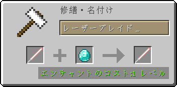
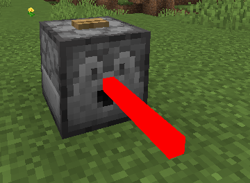
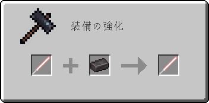
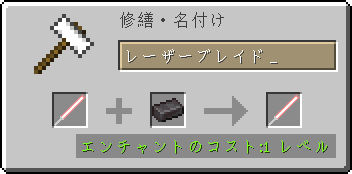
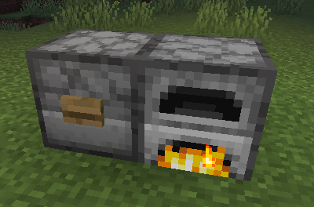

# ToLaserBlade v1.16.1-3.1.6.0

## 動作環境

- Minecraft 1.16.1
- Minecraft Forge 1.16.1-32.0.98+

### 推奨mod

- Just Enough Items (JEI)　クラフトやアップグレードのレシピをゲーム内で見ることができる

## ダウンロード

- [ダウンロードサイト（Curse Forge）](https://www.curseforge.com/minecraft/mc-mods/tolaserblade/files)

### JARファイルについて

- 当modのjarファイルの著作権はmodの著作者に帰属します
- ただし、内容を変更していない完全な状態での再配布やmodパックへの収録は可能です
- Modの利用や配布にあたってはMojang Studiosの定めるMinecraftエンドユーザーライセンス条項（EULA）及びガイドラインに従ってください

## アイテム解説

### DXレーザーブレ一ド / DX Laser B1ade

  
Item ID: `tolaserblade:dx_laser_blade`

- タイプ：剣
- 攻撃速度：2.8
- 攻撃力：5
- 耐久値：255
- エンチャントテーブルで剣タイプのエンチャントが可能

>レーザーブレイドを模して木の棒にレッドストーンを塗った剣。元々は刃が光ったり音が鳴ったりと様々なギミックが仕込まれていたというが、電源となるパーツが失われてしまったため今はもう動かない。バニラの剣よりも少しだけ攻撃力の回復が早く、石の剣並みの攻撃力と鉄の剣並みの耐久力がある。

#### レシピ

素材：レッドストーントーチ×2、棒×1  

#### 隠し機能

右クリックでレッドストーントーチに関連した隠し機能が使用できる。

- 耐久値が半分以上残っているとき、地面や壁をスニーク状態で右クリックすると耐久値を消費してレッドストーントーチを設置する
- 耐久値が半分未満のとき、設置されたレッドストーントーチを右クリックするとそれを消費して耐久値を回復する
- 耐久値が半分以上のとき、設置されたレッドストーントーチを右クリックするとそれを回収する

### レーザーブレイド / Laser Blade

  
Item ID: `tolaserblade:laser_blade`

- タイプ：剣
- 基本攻撃速度：2.8
- 基本攻撃力：7
- 耐久値：32000
- クラフト時に【光属性（Light Element）】と【効率強化（Efficiency）】のエンチャントが付与される
  - 【光属性】は当modで追加される独自のエンチャントであり、アンデッドと邪悪な村人へのダメージが増加する（最大レベルX）
  - 【効率強化】はレベルが高いほどレーザーブレイドの採掘速度が上昇する。一方で【効率強化】がエンチャントされていない状態では採掘能力を失う
- クラフト時にプレイヤーがいたバイオームの種類によっては、刃の色が赤以外になることもある
- 右マウスボタンで盾のようにガード（ブロッキング）することができる（要コンフィグファイル編集）

#### 【光属性I】＆【効率強化I】レシピ

素材：ガラス×2、鉄インゴット×4、ダイヤモンド×2、レッドストーンダスト×1  

>古代文明の超技術で作られたかもしれないレーザーの刃を持つ《絶対に刃こぼれしない》剣。レッドストーンで励起させたイオン添加ガラスの発する光で励起させたダイヤモンドから発生した光を反射によって増幅し、ダイヤモンドのレンズで収束させてからレッドストーンの力場に閉じ込めることで棒状の光の刃にしているという。たぶん光属性なのでアンデッドや邪悪な村人に対して強い。なお本来の用途は切削用の工具であり、古代文明の歴史書によれば、レーザーデバイスの規制が強化される以前は都市部の電気街や観光地の土産物屋でも簡単に入手することができたという。

- エンチャント：光属性I、効率強化I

#### 【光属性II】＆【効率強化I】レシピ

素材：グロウストーンダスト×2、鉄インゴット×4、ダイヤモンド×2、レッドストーンダスト×1  

>一次レーザー媒質をイオン添加ガラスからグロウストーンに変更して出力を強化したレーザーブレイド。そのおかげか光属性がさらに強まったようだ。古代文明が栄えまだグロウストーンが地上でよく採れた時代にはこの発振方式が主流であったと怪しい古文書は伝える。

- エンチャント：光属性II、効率強化I

#### 色の変更

レーザーブレイドは金床で特定のアイテムと合成することにより色を変更することができる。

- 「色付きガラス」と合成すると「刃の外側部分」の色を変更することができる  
  
- 「色付きガラス板」と合成すると「刃の内側部分」の色を変更することができる  
  
- 「カーペット」と合成すると「柄の部分」の色を変更することができる  
  

#### アップグレード

金床で特定のアイテムとレベルを消費することによりレーザーブレイドを強化することができる。

- 「ダイヤモンド」と合成すると〔攻撃力〕が1上昇する（最大で+8、コンフィグで変更可）
- 「金インゴット」と合成すると〔攻撃速度〕が0.4上昇する（最大で+1.2）
- 「グロウストーン」と合成すると【光属性】のレベルが1上昇する
- 「レッドストーンブロック」と合成すると【効率強化】のレベルが1上昇する
- 「レッドストーンダスト」と合成すると【効率強化】を完全に除去する
- 「ブレイズロッド」と合成すると【火属性】のレベルが1上昇する
- 「エンダーアイ」と合成すると【範囲ダメージ増加】のレベルが1上昇する
- 「オウムガイの殻」または「エメラルドブロック」と合成すると【ドロップ増加】のレベルが1上昇する
- 「ネザースター」または「ドラゴンの頭」または「不死のトーテム」と合成すると【修繕】を付与する

アップグレード時の消費レベルはアップグレードの回数を重ねるごとに増加する。

#### 修理

耐久値の減ったレーザーブレイドは金床で「鉄インゴット」と合成すると耐久値を回復させることができる。

>《絶対に刃こぼれしない》を謳うレーザーブレイドが消耗することについて消費者保護団体がメーカーに問い詰めたところ、メーカー側は苦し紛れにも「消耗しているのはグリップ部分であり刃自体は消耗していない」と弁明した。結局、メーカーがグリップの無償交換に応じることでこの事態は収まったという。

#### レーザートラップ

レーザートラップはレーザーブレイドを用いて無人で攻撃を行う機能である。

  
Entity ID: `tolaserblade:laser_trap`

ディスペンサーにレーザーブレイドを入れてレッドストーン動力を送ると、ディスペンサーの向いている方に対して至近距離の範囲攻撃を行うことができる。

レーザートラップの攻撃力にはレーザーブレイドの攻撃力が用いられる。また、レーザーブレイドのエンチャントは【ドロップ増加】のみが有効で、その他のエンチャントは攻撃に影響しない。

レーザートラップはコンフィグで無効化することもできる。その場合は普通にディスペンサーからレーザーブレイドのアイテムが射出される。

### 壊れたレーザーブレイド / Broken Laser Blade

  
Item ID: `tolaserblade:lb_broken`

レーザーブレイドが耐久値の消耗により破壊された際にドロップする。元のレーザーブレイドの状態が保存されており、修復することによってレーザーブレイドへ戻すことができる。

- 金床で「鉄インゴット」と合成すると修復することができる  
  

>グリップ部分の消耗によってブレイドを放出できなくなったレーザーブレイド。レッドストーンのエネルギーは非常に強力である反面とても安定しているため、（我々の期待に反して）このような状態でも大爆発を起こしたりするようなことはない。

### レーザーブレイド / Laser Blade（耐火）

  
Item ID: `tolaserblade:laser_blade_fp`

- 基本攻撃力：8
- ドロップアイテムの状態で炎や溶岩の中でも燃え尽きない（爆発やサボテンでは普通に消滅するので注意）。また溶岩の中でも浮かぶ
- アイテムの外観は通常のものと変わらないが、ツールチップに`耐熱強化 8000`（`HEAT RESISTANT 8000`）の表示が追加される
- その他の能力・アップグレード・修復方法は通常のレーザーブレイドと同様

#### レシピ

通常のレーザーブレイドを鍛冶台または金床で「ネザライトインゴット」と合成すると入手できる。レーザーブレイドの状態は合成前のものが引き継がれる。

素材：ネザライトインゴット×1  
 

#### 修理

耐久値の減ったレーザーブレイド（耐火）は金床で「鉄インゴット」と合成すると耐久値を回復させることができる。

#### レーザートラップ（かまど加熱機能）

レーザーブレイド（耐火）のレーザートラップを「かまど」に対して使用した場合、そのかまどを加熱することができる（コンフィグで無効化も可能）。

なお、基本的なレーザートラップの機能は通常のレーザーブレイドを使用したものと同じである。

### 壊れたレーザーブレイド / Broken Laser Blade（耐火）

  
Item ID: `tolaserblade:lb_broken_fp`

レーザーブレイド（耐火）が耐久値の消耗により破壊された際にドロップする。元のレーザーブレイドの状態が保存されており、修復することによってレーザーブレイド（耐火）へ戻すことができる。

アイテムの外観は通常のものと変わらないが、ツールチップに`耐熱強化 8000`（`HEAT RESISTANT 8000`）の表示が追加される。

#### 修理

耐久値の減ったレーザーブレイドは金床で「鉄インゴット」と合成すると耐久値を回復させることができる。

## 設定項目（コンフィグ）

ゲームフォルダ内のconfigフォルダ内に生成される。

### tolaserblade-common.toml

サーバーとクライアントの両方で使用される設定。マルチプレイ時はサーバー側の設定が用いられる。

- **enableBlockingWithLaserBlade**
  - レーザーブレイドによる攻撃のガード（ブロッキング）を有効にする（`true`で有効、`false`で無効）
- **laserBladeEfficiencyInServer**
  - レーザーブレイドの採掘速度（`0`にすると採掘不可）
- **maxAttackDamageUpgradeCount**
  - レーザーブレイドの攻撃力の最大アップグレード回数（デフォルトよりも低い値にすると一部の進捗が達成不能となるので注意）
- **enableLaserTrap**
  - レーザートラップを有効にする（`true`で有効、`false`で無効）
- **canLaserTrapAttackPlayer**
  - レーザートラップがプレイヤーを攻撃可能か（`true`で可能、`false`で不可）
- **canLaserTrapHeatUpFurnace**
  - レーザーブレイド（耐火）を使ったレーザートラップがかまどを加熱可能か（`true`で可能、`false`で不可）

### tolaserblade-client.toml

クライアントでのみ使用される設定。

- **showUpdateMessage**
  - ToLaserBladeのアップデートをゲーム内のチャットで通知するか（`true`でする、`false`でしない）
- **useFixedVertexBuffer**
  - Modのvertex bufferをMinecraftのfixedVertexBufferに追加するか（`true`でする、`false`でしない）
  - レーザーブレイドのパーツの描画順に関係。これは一部の描画順に関する問題を解決するが、また別の描画順に関する問題を発生させる可能性がある
- **useInternalModel**
  - レーザーブレイドの描画に内部モデルを使用するか（`true`なら内部モデル、`false`なら外部モデルを使用）
- **internalModelType**
  - レーザーブレイドを内部モデルで描画するときに使用するモデルタイプ（`-1`なら通常はデフォルトモデルを日付によっては隠しモデルを使用）
- **externalModelType**
  - レーザーブレイドを外部モデルで描画するときに使用するモデルタイプ（`0`ならバニラ同様テクスチャ画像から生成された簡易モデル、`1`ならOBJモデル（非推奨）を使用）

---
&copy; 2016-2020 Iunius118
