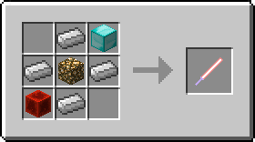
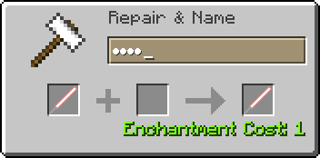
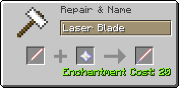
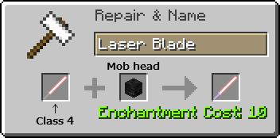

# ToLaserBlade v1.12.2-1.6.0.0

以下の解説は、バージョン 1.12.2-1.6.0.0 時点での仕様に基づいて書かれています。

## 動作環境

- Java 8 以降
- Minecraft 1.12.2
- Minecraft Forge 1.12.2-14.23.3.2655+

## ダウンロード

- [ダウンロードサイト（Curse Forge）](https://minecraft.curseforge.com/projects/tolaserblade)

## アイテム解説

### Laser B1ade / レーザーブレ一ド  (Prop / 模造品)

>レーザーブレイドを模して木の棒にレッドストーンを塗った剣。バニラの剣よりも少しだけ攻撃力の回復が早く、石の剣並みの攻撃力と鉄の剣並みの耐久力がある。

- タイプ：剣
- 攻撃速度：2.8
- 攻撃力：5
- 耐久度：255
- エンチャントテーブルで剣タイプのエンチャントが可能

右クリックでレッドストーントーチに関連した隠し機能が使用できる。

- 耐久度が半分以上残っているとき、地面や壁を右クリックすると耐久度を消費してレッドストーントーチを設置する
- 耐久度が半分未満のとき、設置されたレッドストーントーチを右クリックするとそれを消費して耐久度を回復する
- 耐久度が半分以上のとき、設置されたレッドストーントーチを右クリックするとそれを回収する

### Laser Blade / レーザーブレイド

- タイプ：剣
- 耐久度：∞
- クラフト方法によって性能がクラス1～3まで変化する。また、金床によってクラス4への強化が可能。
- （設定ファイルの変更で有効にすると）右マウスボタンで盾のようにガード（ブロッキング）することができる

#### クラス 1

 

>古代文明の超技術で作られたかもしれないレーザーの刃を持つ《絶対に刃こぼれしない》剣。レッドストーンの力で励起させたイオン添加ガラスの発する光を反射によって増幅し、ダイヤモンドのレンズで収束させてからレッドストーンの力場に閉じ込めることで棒状にしているという。なお本来の用途は切削用の工具であった。

- 攻撃速度：2.8
- 攻撃力：6
- 地上（オーバーワールド）の素材のみでクラフト可能
- 中央はガラスまたは色付きガラス。色付きガラスの場合はその色に応じて刃の周辺部分の色が変わる
- エンチャントテーブルで剣タイプのエンチャントが可能

#### クラス 2

>レーザー媒質をイオン添加ガラスからグロウストーンに変更して出力を強化したレーザーブレイド。そのおかげか攻撃力はダイヤモンドの剣並みになった。古代文明が栄えまだグロウストーンが地上でよく採れた時代にはこの発振方式が主流であったと古文書は伝える。

- 攻撃速度：2.8
- 攻撃力：7
- エンチャントテーブルで剣タイプのエンチャントが可能

#### クラス 3

>グロウストーンとダイヤモンドを増量して出力をさらに強化したレーザーブレイド。ついでにレッドストーンを大量に添加することによって攻撃時の出力回復速度も向上させた。出力強化の過程でたぶん光属性を持ち、特にアンデッドに対して強くなっている。

- 攻撃速度：4
- 攻撃力：10
- エンチャント：アンデッド特効 (Smite) V
- クラフトした時点でエンチャントされている

クラス1～2のレーザーブレイド（ただし未エンチャントに限る）は、以下のように金床を使ってクラス3相当に強化することが可能。

- 未エンチャントのレーザーブレイドの名前を金床で特定のワードに変更する
- ヒント：かな4文字［A5=お, T2U, A1L=か, W1R］

#### クラス 4

>魔術的なレアアイテムを組み込んで出力をさらにさらに強化したレーザーブレイド。攻撃力が増加し、アンデッドに対してもさらに強くなった。最早これは工具というレベルではない。

- 攻撃速度：4
- 攻撃力：14
- エンチャント：アンデッド特効 (Smite) X、範囲ダメージ増加 (Sweeping Edge) III
- 強化前のレーザーブレイドにアンデッド特効と相反するエンチャントが付いていた場合は、アンデッド特効で上書きされる

#### クラス 4+

- 金床でクラス4のレーザーブレイドとmobの頭を合成すると、攻撃力をさらに上げることができる。

#### 刃染色レシピ

- 単体クラフトすると刃の周辺部分の色がプレイヤーのいるバイオーム（多くはその基準温度）に応じて変化する
- 刃の色は全部で9色
- クラフトスロットからはマウスでドラッグして取り出すこと（Shiftクリックの場合は染色されない）
- クラフト後アイテムの情報が更新されるまでは何色に染色されたのかはわからない
- 性能はクラフト前のものが引き継がれる

- 金床で染料と合成するとその色に応じて刃の中心部分の色を変更することができる

- 金床で色付きガラスと合成するとその色に応じて刃の周辺部分の色を変更することができる

## 設定項目

設定ファイル（`tolaserblade.cfg`）はmod導入後の起動時にゲームフォルダの`config`フォルダ内に自動生成される。クライアント側ではゲーム内modオプションのコンフィグGUIでも変更可能。

### common

サーバー・クライアント共通の設定項目。マルチプレイワールドではサーバー側の設定が優先される。

- enableBlockingWithLaserBlade
  - 真偽値、デフォルトは`false`
  - レーザーブレイド装備時に右マウスボタンでガードすることが可能か（可能：`true` / 無効：`false`）
- laserBladeEfficiency
  - 整数値 0～128、デフォルトは`12`
  - レーザーブレイドの採掘速度
  - 値が小さいほど遅く、大きいほど速くなる。`0`にするとブロックを採掘できなくなる

### client

クライアント側限定の設定項目。クライアント側のみで使用される。

- enableLaserBlade3DModel
  - 真偽値、デフォルトは`true`
  - レーザーブレイドの描画に、true：3D（OBJ）モデルを使用するか、false：2D（JSON）モデルを使用するか
  - この設定はクライアント側でのみ使われる
- laserBladeRenderingMode
  - 整数値 0～1、デフォルトは`0`
  - レーザーブレイドの刃の描画モードを選択する
  - `0`を指定すると従来通りの描画方式、`1`を指定すると加算・減算合成を用いない描画方式になる
  - この項目は`enableLaserBlade3DModel`が`true`のときのみ使用される

---
Copyright 2016-2019 Iunius118

This mod is released under the MIT license but including resources licensed under a Creative Commons Attribution-NonCommercial 4.0 International (CC BY-NC 4.0) License.

このmodはMITライセンスで配布されていますが、リソースにクリエイティブコモンズ 表示 - 非営利 4.0（CC BY-NC 4.0）ライセンスで配布されているファイルを含みます。
