# ToLaserBlade v1.13.2-2.0.1.0

以下の解説は、バージョン 1.13.2-2.0.1.0 時点での仕様に基づいて書かれています。

## 動作環境

- Java 8 以降
- Minecraft 1.13.2
- Minecraft Forge 1.13.2-25.0.149+

## ダウンロード

- [ダウンロードサイト（Curse Forge）](https://minecraft.curseforge.com/projects/tolaserblade)

## アイテム解説

### Laser B1ade / レーザーブレ一ド  (Prop / 模造品)

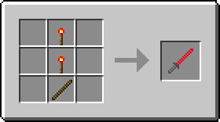

>レーザーブレイドを模して木の棒にレッドストーンを塗った剣。バニラの剣よりも少しだけ攻撃力の回復が早く、石の剣並みの攻撃力と鉄の剣並みの耐久力がある。

- タイプ：剣
- 攻撃速度：2.8
- 攻撃力：5
- 耐久度：255
- エンチャントテーブルで剣タイプのエンチャントが可能

右クリックでレッドストーントーチに関連した隠し機能が使用できる。

- 耐久度が半分以上残っているとき、地面や壁を右クリックすると耐久度を消費してレッドストーントーチを設置する
- 耐久度が半分未満のとき、設置されたレッドストーントーチを右クリックするとそれを消費して耐久度を回復する
- 耐久度が半分以上のとき、設置されたレッドストーントーチを右クリックするとそれを回収する

### Laser Blade / レーザーブレイド

- タイプ：剣
- 耐久度：32000
- エンチャントテーブルでのエンチャントは不可（金床での付与は可能）
- 攻撃力や攻撃速度、エンチャントは「アイテムによる強化」または「エンチャントの合成」で強化することが可能となっている
- （設定ファイルの変更で有効にすると）右マウスボタンで盾のようにガード（ブロッキング）することができる

#### 攻撃力 6 ＆ アンデッド特効 I レシピ

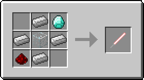 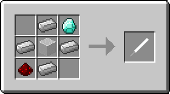

>古代文明の超技術で作られたかもしれないレーザーの刃を持つ《絶対に刃こぼれしない》剣。レッドストーンの力で励起させたイオン添加ガラスの発する光を反射によって増幅し、ダイヤモンドのレンズで収束させてからレッドストーンの力場に閉じ込めることで棒状にしているという。たぶん光属性なのでアンデッドに対して強い。なお本来の用途は切削用の工具であった。

- 攻撃速度：2.8
- 攻撃力：6
- 地上（オーバーワールド）の素材のみでクラフト可能
- 中央はガラスまたは色付きガラス。色付きガラスの場合はその色に応じて刃の周辺部分の色が変わる
- エンチャント：アンデッド特効（Smite） I
- クラフトした時点でエンチャントされている

#### 攻撃力 7 ＆ アンデッド特効 II レシピ

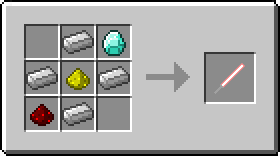

>レーザー媒質をイオン添加ガラスからグロウストーンに変更して出力を強化したレーザーブレイド。そのおかげか攻撃力はダイヤモンドの剣並みになった。古代文明が栄えまだグロウストーンが地上でよく採れた時代にはこの発振方式が主流であったと古文書は伝える。

- 攻撃速度：2.8
- 攻撃力：7
- エンチャント：アンデッド特効（Smite） II
- クラフトした時点でエンチャントされている

#### 刃染色レシピ

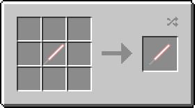

- 単体クラフトすると刃の周辺部分の色がプレイヤーのいるバイオーム（多くはその基準温度）に応じて変化する
- 刃の色は全部で9色
- クラフトスロットからはマウスでドラッグして取り出すこと（Shiftクリックの場合は染色されない）
- クラフト後アイテムの情報が更新されるまでは何色に染色されたのかはわからない
- 性能はクラフト前のものが引き継がれる

#### カスタムレシピ

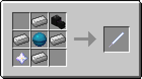

- このmodで追加されるレシピタイプ`tolaserblade:crafting_laser_blade_custom`を利用すると、性能をカスタマイズしたレーザーブレイドのレシピをデータパックに追加することができる
- サンプルレシピがmodのjarファイル内の`data/tolaserblade/recipes/laser_blade_custom_sample.json`にあるので参考に（実際にゲーム内にも読み込まれる）

#### 金床での刃染色

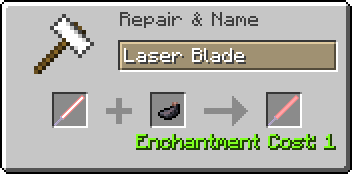

- 金床で染料と合成するとその色に応じて刃の中心部分の色を変更することができる

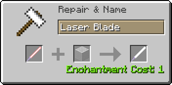

- 金床で色付きガラスと合成するとその色に応じて刃の周辺部分の色を変更することができる

#### 金床での合成

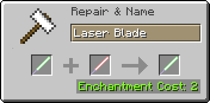 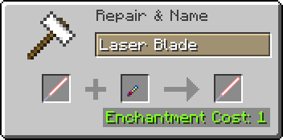 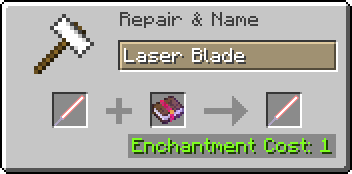

- レーザーブレイドやレーザーブレイドのコアに、レーザーブレイドやレーザーブレイドのコア、エンチャントの本の持っているエンチャントを合成することができる
- レーザーブレイドへの合成時はダメージ増加（Sharpness）は攻撃力に、耐久力（Unbreaking）は攻撃速度に変換される

#### 金床での強化

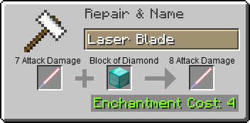

- 金床で特定のアイテムと一定のレベルを消費することによりレーザーブレイドを強化することができる

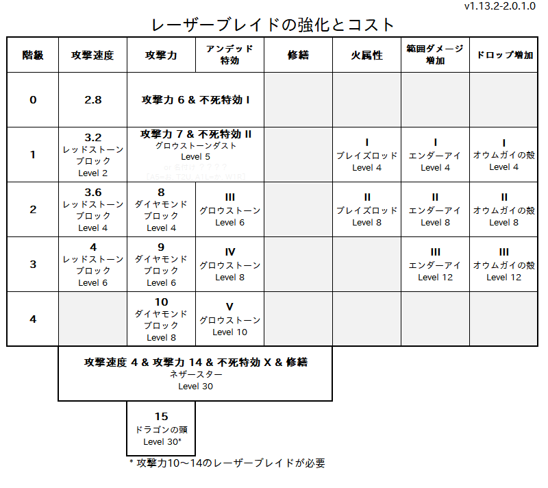

- 攻撃力10～14のレーザーブレイドに金床でドラゴンの頭を合成すると、攻撃力を15にすることができる

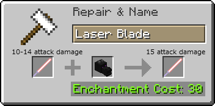

#### 金床での修理

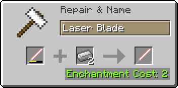

>《絶対に刃こぼれしない》レーザーブレイドが消耗することについて消費者保護団体がメーカーを問い詰めると、メーカー側は苦し紛れにも「消耗しているのはグリップ部分であり刃自体は消耗していない」と弁明した。結局、メーカーがグリップの無償交換に応じることで事態は収まったという。

- 残りの耐久値に応じた数の鉄インゴットとレベルを消費する

### Laser Blade Core / レーザーブレイドのコア

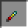

>レーザーブレイドのコアとなるレーザー発振器。レッドストーンのエネルギーは非常に強力である一方とても安定しているため、（我々の期待に反して）手荒に扱っても大爆発を起こしたりするようなことはない。古代文明の歴史書によれば、レーザーデバイスの規制が強化される以前は電気街や観光地の土産物屋で簡単に入手することができたという。

- レーザーブレイドが消耗により破壊された際に手に入る

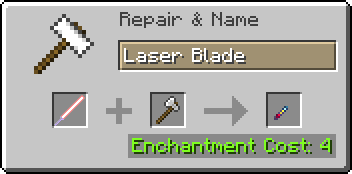

- また金床で鉄の斧の耐久値とレベルを消費して強制的にコアを取り出すこともできる

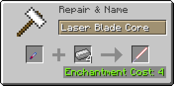

- コアは金床で鉄インゴットとレベルを消費してレーザーブレイドに戻すことができる

## 設定項目

設定ファイルはmod導入後の起動時にゲームフォルダの`config`フォルダ内に自動生成される。

### tolaserblade-common.toml

サーバー・クライアント共通の設定ファイル。マルチプレイワールドではサーバー側の設定が優先される。

- enableBlockingWithLaserBlade
  - 真偽値、デフォルトは`false`
  - レーザーブレイド装備時に右マウスボタンでガードすることが可能か（可能：`true` / 無効：`false`）
- laserBladeEfficiency
  - 整数値 0～128、デフォルトは`12`
  - レーザーブレイドの採掘速度
  - 値が小さいほど遅く、大きいほど速くなる。`0`にするとブロックを採掘できなくなる

### tolaserblade-client.toml

クライアント側限定の設定ファイル。クライアント側のみで使用される。
  <!-- - ゲーム内のmodオプション設定GUIでも変更可能 -->

- enableLaserBlade3DModel
  - 真偽値、デフォルトは`true`
  - レーザーブレイドの描画に、`true`のときは3D（OBJ）モデルを使用し、`false`のときは2D（JSON）モデルを使用する
- laserBladeRenderingMode
  - 整数値 0～1、デフォルトは`0`
  - レーザーブレイドの刃の描画モードを選択する
  - `0`を指定すると従来通りの描画方式、`1`を指定すると加算・減算合成を用いない描画方式になる
  - この項目は`enableLaserBlade3DModel`が`true`のときのみ使用される

---
Copyright 2016-2019 Iunius118

This mod is released under the MIT license but including resources licensed under a Creative Commons Attribution-NonCommercial 4.0 International (CC BY-NC 4.0) License.

このmodはMITライセンスで配布されていますが、リソースにクリエイティブコモンズ 表示 - 非営利 4.0（CC BY-NC 4.0）ライセンスで配布されているファイルを含みます。
